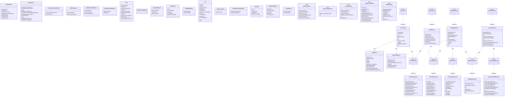

```mermaid
classDiagram
    %% FileBlogSystem Class Diagram

    class EmailService {
        -EmailService()
        -SmtpClient()
        -NetworkCredential()
        +SendPasswordResetEmail()
        -MailMessage()
        +SendOtpEmail()
        -MailMessage()
    }

    class LuceneSearchService {
        -LuceneSearchService()
        -StandardAnalyzer()
        -GetWriter()
        -IndexWriterConfig()
        -IndexWriter()
        +RebuildIndex()
        -if()
        -StringField()
        -TextField()
        -TextField()
    }

    class NotificationService {
        -NotificationService()
        +SendNotificationAsync()
        -if()
        -if()
        -GetAllAsync()
        +MarkAsReadAsync()
        -if()
    }

    class JwtService {
        -JwtService()
        +GenerateToken()
        -Claim()
        -Claim()
        -Claim()
        -SymmetricSecurityKey()
        -SigningCredentials()
        -JwtSecurityToken()
        -JwtSecurityTokenHandler()
        +GetTokenValidationParameters()
    }

    class AdminService {
        -AdminService()
        -DirectoryInfo()
        -UserDirectoryExists()
        -SanitizeDirectoryName()
        +PromoteUserToAdmin()
        +GetAllUsers()
        +BackfillPublishedCounts()
    }

    class PasswordService {
        +HashPassword()
        +VerifyPassword()
        +GenerateAndStoreResetToken()
        -Random()
        +ValidateResetToken()
        +ClearResetToken()
    }

    class UserService {
        -UserService()
        +LoginUser()
        -if()
        +RegisterUser()
        -if()
        -if()
        +GetUserProfile()
        -profile()
        +UpdateUserProfile()
        -if()
    }

    class BlogPostService {
        -BlogPostService()
        +GetAllPosts()
        +GetPostsByCategory()
        +GetPostsByTag()
        -if()
        +GetUserDrafts()
        +CreatePostAsync()
        -naming()
        -Post()
        -if()
    }

    class CommentService {
        -CommentService()
        +AddCommentAsync()
        -if()
        +GetCommentByIdAsync()
        +UpdateCommentAsync()
        -if()
        +DeleteCommentAsync()
        +GetCommentsCountForPostAsync()
        +ApproveCommentAsync()
        +RejectCommentAsync()
    }

    class ImageService {
        -SaveAndCompressAsync()
        -InvalidOperationException()
        -Size()
        -SaveWithFormatAsync()
        -SaveAndCompressFromBase64Async()
        -InvalidOperationException()
        -MemoryStream()
        -Size()
        -SaveWithFormatAsync()
        -SaveWithFormatAsync()
    }

    class ScheduledPostPublisher {
        -ScheduledPostPublisher()
        -ExecuteAsync()
    }

    class NotificationHub {
        -NotificationHub()
        -OnConnectedAsync()
    }

    class ResetPasswordRequest {
        +string Username
        +string OTPCode
        +string NewPassword
    }

    class ForgotPasswordRequest {
        +string Username
        +string Email
    }

    class User {
        +string Username
        +string Email
        +string PasswordHash
        +string Role
        +DateTime CreatedAt
        +string ProfilePictureUrl
        +string Bio
        +DateTime LastLoginDate
        +bool IsActive
        +int PublishedPostsCount
    }

    class UpdateProfileRequest {
    }

    class RegisterRequest {
        +string Username
        +string Email
        +string Password
    }

    class Notification {
        +int Id
        +string Message
        +string Link
        +bool IsRead
        +DateTime CreatedAt
    }

    class VerifyOtpRequest {
        +string Username
        +string OTPCode
    }

    class Post {
        +string Id
        +string Title
        +string Description
        +string Body
        +string Author
        +DateTime PublishedDate
        +List<string> Tags
        +List<string> Categories
        +string Slug
        +bool IsPublished
        -Post()
    }

    class AddCommentDto {
        +string Content
    }

    class ChangePasswordRequest {
        +string CurrentPassword
        +string NewPassword
    }

    class Comment {
        +string Id
        +string Content
        +string Author
        +DateTime CreatedAt
    }

    class CreatePostRequest {
        +string Title
        +string Description
        +string Body
        +List<string> Tags
        +List<string> Categories
    }

    class LoginRequest {
        +string Username
        +string Password
    }

    class AdminEndpoints {
        <<static>>
        -IsValidUsername()
        +MapAdminEndpoints()
        -GetAllUsersAsync()
        -PromoteUserToAdminAsync()
        -CheckAdminStatus()
        -BackfillPublishedCounts()
    }

    class CommentsEndpoints {
        <<static>>
        +MapCommentsEndpoints()
        -if()
    }

    class AuthEndpoints {
        <<static>>
        +MapAuthEndpoints()
        -LoginUserAsync()
        -RegisterUserAsync()
        -ChangeUserPasswordAsync()
        -if()
        -IsValidEmail()
    }

    class BlogPostEndpoints {
        <<static>>
        -IsValidSlug()
        -IsValidCategory()
        -IsValidTag()
        -IsValidUsername()
        +MapBlogPostEndpoints()
        -GetPublishedPostsAsync()
        -GetPostsAsync()
        -GetPostsByCategoryAsync()
        -GetPostsByTagAsync()
        -GetPostBySlugAsync()
    }

    class UserEndpoints {
        <<static>>
        +MapUserEndpoints()
        -IsValidUsername()
        -IsValidEmail()
        -IsValidOtp()
        -IsValidPassword()
        -GetNotificationsAsync()
        -if()
        -password()
    }

    class FilePostRepository {
        -GetLock()
        -SemaphoreSlim()
        -FilePostRepository()
        -LoadPostAsync()
        -IsUserActiveAsync()
        -GetAllPostsAsync()
        +GetPostBySlugAsync()
        -LoadPostAsync()
        -IsUserActiveAsync()
        +GetPostByIdAsync()
    }

    class FileCommentRepository {
        -FileCommentRepository()
        -FindPostDirectoryBySlugAsync()
        +GetCommentByIdAsync()
        +CreateCommentAsync()
        -FindPostDirectoryBySlugAsync()
        -InvalidOperationException()
        -if()
        +UpdateCommentAsync()
        -FindPostDirectoryBySlugAsync()
        +DeleteCommentAsync()
    }

    class FileUserRepository {
        -FileUserRepository()
        +GetUserByUsernameAsync()
        +GetUserByEmailAsync()
        +UserExistsAsync()
        -GetUserByUsernameAsync()
        +EmailExistsAsync()
        -GetUserByEmailAsync()
        +IsUserActiveAsync()
        -GetUserByUsernameAsync()
        +CreateUserAsync()
    }

    class ISearchService {
        <<interface>>
    }

    class IUserService {
        <<interface>>
    }

    class IBlogPostService {
        <<interface>>
    }

    class IAdminService {
        <<interface>>
    }

    class INotificationService {
        <<interface>>
    }

    class ICommentService {
        <<interface>>
    }

    class IUserRepository {
        <<interface>>
    }

    class IPostRepository {
        <<interface>>
    }

    class ICommentRepository {
        <<interface>>
    }

    ISearchService <|.. LuceneSearchService : implements
    INotificationService <|.. NotificationService : implements
    IAdminService <|.. AdminService : implements
    IUserService <|.. UserService : implements
    IBlogPostService <|.. BlogPostService : implements
    ICommentService <|.. CommentService : implements
    IPostRepository <|.. FilePostRepository : implements
    ICommentRepository <|.. FileCommentRepository : implements
    IUserRepository <|.. FileUserRepository : implements
    BlogPostService --> IPostRepository : uses
    BlogPostService --> ISearchService : uses
    BlogPostService --> INotificationService : uses
    UserService --> IUserRepository : uses
    UserService --> PasswordService : uses
    UserService --> JwtService : uses
    CommentService --> ICommentRepository : uses
    CommentService --> INotificationService : uses
    AdminService --> IUserRepository : uses
    AdminService --> IPostRepository : uses
```